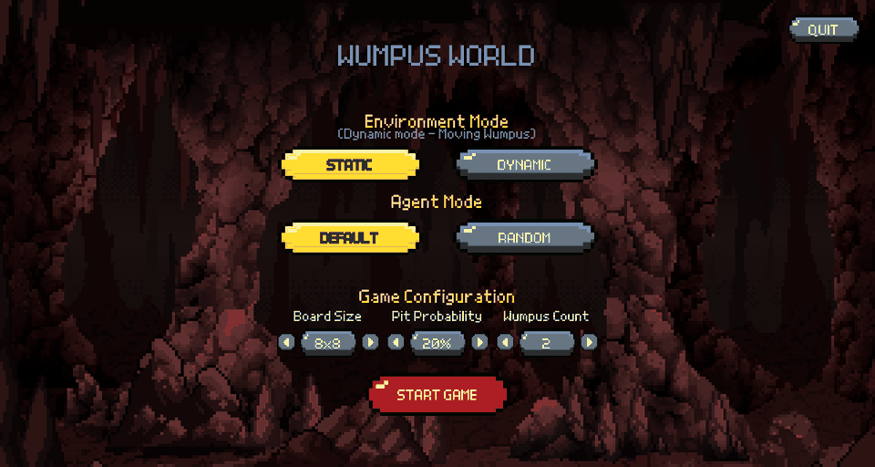
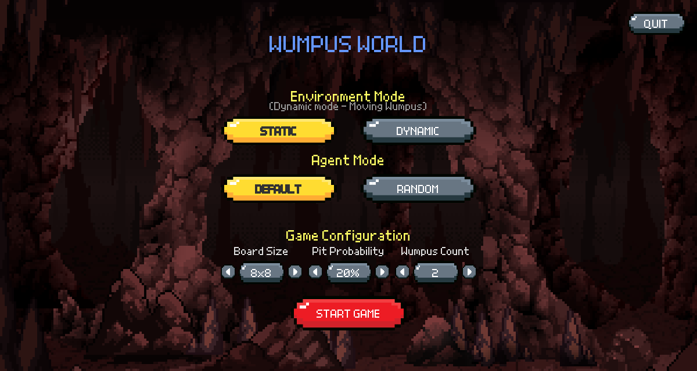
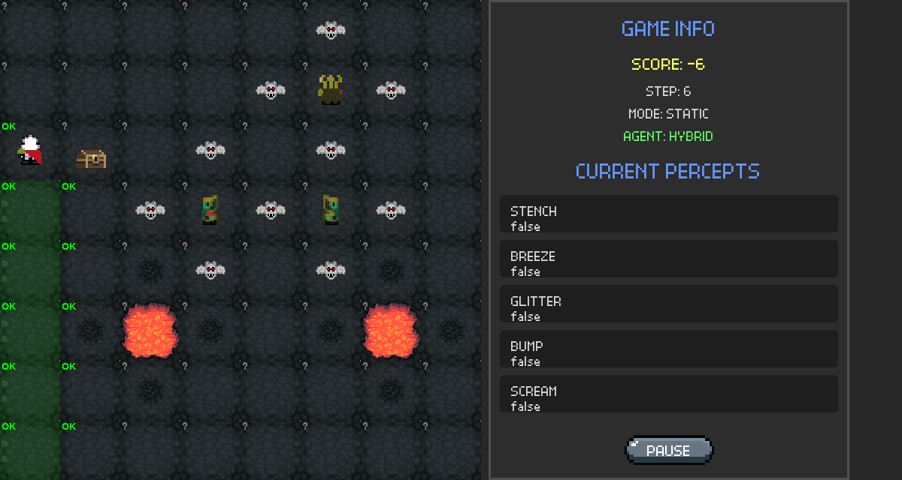
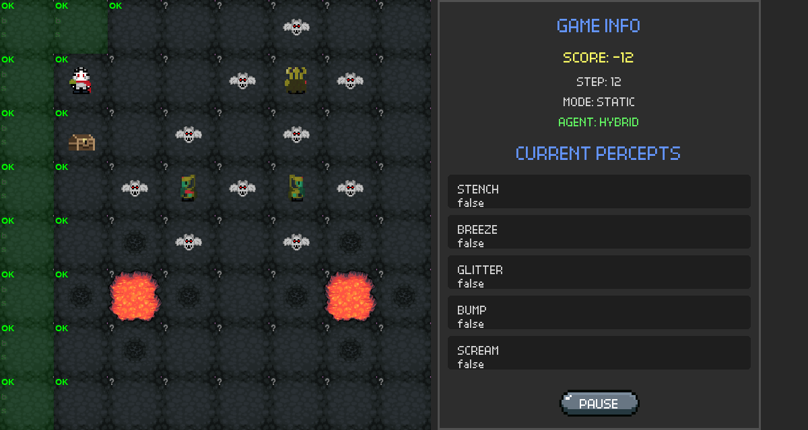
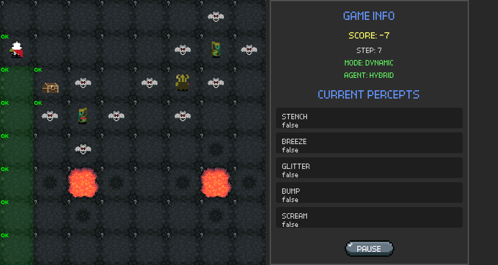
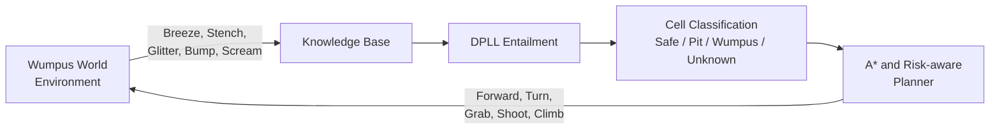

<div align="center">
  

  <h1>Wumpus World AI Agent</h1>

  <p><strong>A knowledge-based autonomous agent that combines propositional logic, DPLL inference, and A* planning to solve static and dynamic Wumpus World environments.</strong></p>

  <p>
    
    
    
    <a href="LICENSE"></a>
  </p>

  <p>
    <a href="#demo">Demo</a> ·
    <a href="#how-it-works">How it works</a> ·
    <a href="#benchmark-results">Results</a> ·
    <a href="#getting-started">Getting started</a> ·
    <a href="Report.pdf">Project report</a>
  </p>
</div>



## Overview

Wumpus World is a partially observable environment in which an agent must find the gold and return safely while avoiding pits and Wumpuses. The agent never receives the complete map directly: it must reason from local percepts such as **Breeze**, **Stench**, **Glitter**, **Bump**, and **Scream**.

This project implements a hybrid agent that turns those percepts into logical knowledge, classifies cells by risk, and plans actions toward a safe objective. A Pygame interface visualizes the environment, the agent's inferred knowledge, current percepts, score, and actions in real time.

## Highlights

- **Knowledge-based reasoning** - maintains a symbolic model of safe, unknown, pit, and Wumpus cells.
- **Propositional inference** - uses a custom DPLL SAT solver to test whether the knowledge base entails a conclusion.
- **Goal-directed planning** - applies A* search to reach safe exploration targets and return to the entrance.
- **Risk-aware exploration** - chooses the least risky unknown cell when no confirmed-safe frontier remains.
- **Static and dynamic worlds** - supports multiple Wumpuses, configurable pit density, and moving Wumpuses.
- **Interactive visualization** - displays percepts, knowledge overlays, score, agent state, and arrow trajectories.
- **Measured baseline** - compares the Hybrid Agent against a Random Agent over 250 generated environments.

## Demo

The animation above is generated from the actual Pygame renderer using the deterministic `testcases/map1.json` scenario. It shows the Hybrid Agent exploring the map, updating its knowledge, collecting the gold, returning to the entrance, and climbing out with a final score of **990**.

| Configuration menu | Knowledge-based exploration |
| :---: | :---: |
|  |  |

| Inferred safe cells and percepts | Dynamic Wumpus mode |
| :---: | :---: |
|  |  |

Legend used by the knowledge overlay:

- `OK` - inferred safe cell
- `P` - inferred pit
- `W` - inferred Wumpus
- `?` - unknown cell
- `B/b` - Breeze observed / not observed
- `S/s` - Stench observed / not observed

## How it works



1. **Observe** - the environment returns percepts for the agent's current cell.
2. **Update knowledge** - visited cells and percepts are encoded as propositional clauses.
3. **Infer** - DPLL satisfiability checks determine which hazards or safe cells are logically entailed.
4. **Select a target** - the agent prioritizes unvisited safe cells, known Wumpuses, or a least-risk unknown cell.
5. **Plan and act** - A* produces movement actions while the shooting planner aligns the agent with a known Wumpus.
6. **Complete the mission** - after grabbing the gold, the agent plans a route back to `(0, 0)` and climbs out.

In Dynamic mode, Wumpuses move every five agent actions. Wumpus-related knowledge is then invalidated and rebuilt while static pit knowledge is retained.

## Benchmark results

The committed benchmark evaluates the Hybrid and Random agents on five configurations spanning `8×8` and `10×10` boards, one or two Wumpuses, `5–20%` pit probabilities, and both static and moving-Wumpus modes.

| Agent | Success rate | Average score |
| :--- | ---: | ---: |
| **Hybrid Agent** | **55.6%** | **70.832** |
| Random Agent | 2.0% | -278.868 |

The Hybrid Agent improves the absolute success rate by **53.6 percentage points** over the random baseline. Raw per-environment results and the aggregate summary are available in [`results/comparison_results.csv`](results/comparison_results.csv) and [`results/comparison_summary.json`](results/comparison_summary.json).

## Getting started

### Prerequisites

- Python 3.10 or newer
- Git

### Installation

```bash
git clone https://github.com/nhquana2/ai-project02-23clc01.git
cd ai-project02-23clc01

python -m venv .venv
```

Activate the virtual environment:

```powershell
# Windows PowerShell
.\.venv\Scripts\Activate.ps1
```

```bash
# macOS or Linux
source .venv/bin/activate
```

Install the dependency and launch the GUI:

```bash
pip install -r requirements.txt
python main.py
```

From the menu, choose:

- `STATIC` or `DYNAMIC` environment mode
- `DEFAULT` (Hybrid) or `RANDOM` agent
- board size, pit probability, and Wumpus count

Then select **START GAME**. Press `Esc` or use the on-screen button to pause.

## Reproducing the experiments

Run the randomized Hybrid-versus-Random benchmark:

```bash
python run_comparison.py
```

Run the five predefined scenarios from `testcases/`:

```bash
python run_hybrid_testcases.py
```

Generated metrics, action logs, and final map states are written to `results/`.

## Project structure

```text
ai-project02-23clc01/
├── assets/                  # Sprites, fonts, backgrounds, and buttons
├── docs/media/              # README screenshots, GIF, and benchmark artwork
├── gui/                     # Pygame menu, board, controller, and information panel
├── map/                     # Random benchmark configurations
├── results/                 # Metrics, action logs, and final map states
├── testcases/               # Deterministic evaluation maps
├── agent_knowledge.py       # Symbolic world model
├── environment.py           # Wumpus World simulator and action semantics
├── hybrid_agent.py          # Knowledge-based agent policy
├── inference.py             # DPLL SAT solver and knowledge base
├── inference_engine.py      # Percept-to-clause inference rules
├── planning.py              # A* and risk-aware planning
├── random_agent.py          # Baseline policy
├── run_comparison.py        # Randomized agent comparison
├── run_hybrid_testcases.py  # Deterministic scenario runner
└── main.py                  # GUI entry point
```

## Limitations and future work

- DPLL inference becomes increasingly expensive as the board and knowledge base grow.
- The visualization currently targets a desktop Pygame runtime rather than a browser deployment.
- Dynamic Wumpuses require periodic invalidation of Wumpus-specific knowledge.
- Future improvements could add incremental SAT solving, deterministic replay controls, automated test coverage, and CI benchmark reports.

## Contributors


- Nguyễn Hoàng Quân
- Nguyen Tuấn Anh
- Trần Tiến Cường
- Thái Hoàng Phúc

## Report

The design, knowledge representation, inference rules, experiments, and discussion are documented in the [project report](Report.pdf).

## License

This project is available under the [MIT License](LICENSE).
